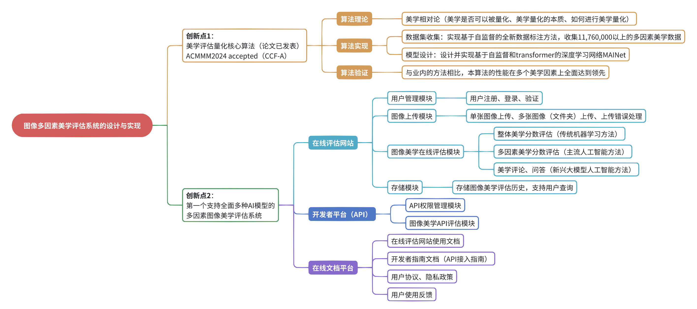

# ibt子系统-文档（源自毕设）

将ibt的一部分（如整体美学、多因素美学、美学问答）抽出，并辅以管理界面（用户登陆注册、API管理、文档界面），形成一个完整的毕设系统。

此代码库为配套文档界面（静态页面，无需后端）。

## 开发基于

[`Next.js`](https://nextjs.org/) 服务器端渲染 和 静态网站生成

[`Nextra`](https://nextra.site/) 站点生成框架

[`MDX`](https://mdxjs.com/) 支持js交互的轻量级标记语言